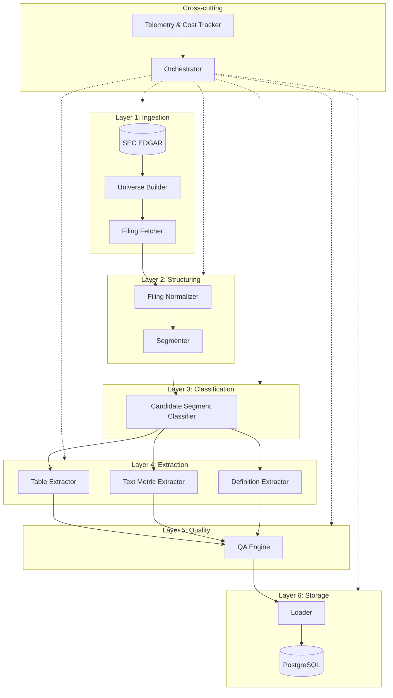

# 04_SYSTEM_ARCHITECTURE

Version: 0.1  
Date: 2025-11-15  
Owner: Rob Markey  

## 1. Purpose

This document describes the **system architecture** for the Customer Metrics Filings Analysis project.

It defines:

- The major components and services
- How data flows from SEC filings into the analytical data model
- Responsibilities and interfaces of each component
- How LLMs are used, controlled, and monitored
- How the design scales to Phase 2 (10-Ks) and additional metrics

This architecture must serve the analytic and data requirements in:

- `01_ANALYTIC_REQUIREMENTS.md`
- `02_METRIC_TAXONOMY_AND_DEFINITIONS.md`
- `03_DATA_MODEL_SPEC.md`

---

## 2. Design goals and constraints

### 2.1 Primary goals

1. **Analysis-first**  
   Architecture is driven by the required outputs (incidence, quality, and metric values) and the data model, not by convenience of extraction.

2. **Provenance-first**  
   Every metric value, definition, and quality score must be traceable to specific segments in specific filings.

3. **Investor-grade defensibility**  
   The system must support audit, replication, and quality evaluation for any published statistic.

4. **Extensibility**  
   Design must support adding:
   - New metrics
   - New filing types (10-Ks in Phase 2)
   - New industries or cohorts

5. **Cost-aware LLM usage**  
   Minimize token spend with:
   - Rules and simple classifiers first
   - Targeted, small-context LLM calls
   - Clear fallbacks and retry rules

### 2.2 Constraints

- Use a relational database (Postgres recommended) as the main store for entities defined in `03_DATA_MODEL_SPEC.md`.
- Use SEC EDGAR as the canonical source for filings; respect rate limits and politeness policies.
- Design for batch processing of **hundreds to thousands** of filings per run.
- Assume multiple developers and contributors, so:
  - Components must have clear interfaces
  - Each component should be testable in isolation

---

## 3. High-level architecture

### 3.1 Logical layers

The system is organized into six logical layers:

1. **Ingestion & universe definition**
   - Discover and classify in-scope filings (Phase 1: S-1 for first-time issuers).
   - Download and persist raw filing documents.

2. **Document structuring & segmentation**
   - Parse each filing into structured sections and segments (paragraphs, tables, footnotes).
   - Populate `source_segments` table.

3. **Candidate detection**
   - Identify segments likely to contain customer metrics, definitions, or methodologies.
   - Use keyword rules and lightweight LLM classification.

4. **Metric extraction**
   - From candidate segments, extract:
     - Numeric metric values (`metric_values`)
     - Definitions and methodologies (`metric_definitions`)
   - Preserve full provenance to `source_segments`.

5. **Quality assessment (QA)**
   - Apply rule-based checks and LLM scoring.
   - Populate `filing_metric_incidence` and QA fields in fact tables.

6. **Orchestration, monitoring, and cost control**
   - Coordinate pipeline runs across filings.
   - Track throughput, failures, and LLM cost.
   - Support restart, partial re-runs, and incremental improvements.

### 3.2 Component map (logical)

At a high level, the system includes the following components/services:

1. **Universe Builder** – builds and maintains the list of in-scope filings.
2. **Filing Fetcher** – downloads and caches raw filings from EDGAR.
3. **Filing Normalizer** – standardizes raw HTML/text for downstream processing.
4. **Segmenter** – splits filings into structured `source_segments`.
5. **Candidate Segment Classifier** – tags segments as likely metric/definition/methodology sources.
6. **Table Extractor** – parses and interprets HTML tables.
7. **Text Metric Extractor** – uses LLMs to extract metric values from narrative text.
8. **Definition/Methodology Extractor** – uses LLMs to summarize and standardize definitions.
9. **QA Engine** – applies rule-based and LLM-based quality checks and scoring.
10. **Loader** – writes extracted data into the core tables (`metric_values`, `metric_definitions`, `filing_metric_incidence`).
11. **Orchestrator** – coordinates the run, handles retries, and writes logs.
12. **Telemetry & Cost Tracker** – collects metrics on performance and LLM cost.

Each component is described in more detail below.

### 3.3 Architecture diagram

**Data flow summary:**
1. **SEC EDGAR → Universe Builder**: Discover S-1/F-1 filings, classify (SPAC, first-time issuer)
2. **Filing Fetcher**: Download and cache HTML documents
3. **Normalizer → Segmenter**: Parse HTML into `source_segments` (paragraphs, tables)
4. **Classifier**: Tag segments with metric candidates and flags
5. **Extractors**: Pull values, definitions, methodologies from segments
6. **QA Engine**: Score disclosure quality (0-3 scale)
7. **Loader → PostgreSQL**: Persist all results with full provenance

---

## 4. Component responsibilities and interfaces

For each component, we describe:

- Responsibility
- Inputs and outputs (schemas or tables)
- Error handling and observable signals

### 4.1 Universe Builder

**Responsibility**

- Build and maintain the universe of in-scope filings for Phase 1.

**Key tasks**

- Query EDGAR for all S-1 and S-1/A filings in 2015–2025.
- Classify filings as:
  - First-time issuers vs others
  - SPAC vs non-SPAC
  - Primary vs secondary vs mixed offerings
- Populate `companies` and `filings` tables with metadata and classification flags.

**Inputs**

- EDGAR master index / search
- Optional manual overrides (CSV or config) for classification corrections

**Outputs**

- `companies` rows
- `filings` rows (with `is_in_scope_phase1`, `is_first_time_issuer`, `is_spac`, `offering_type`, `classification_method`)

**Error handling**

- On network or EDGAR errors: retry with backoff; log failures.
- On ambiguous classifications: flag as `classification_method = 'uncertain'` for manual review.

---

### 4.2 Filing Fetcher

**Responsibility**

- Fetch and cache raw filings for each in-scope `filing_id`.

**Key tasks**

- For each in-scope filing:
  - Download HTML (and optionally text) from SEC.
  - Store raw content on disk or object storage with stable paths.
  - Record locations in `filings` (e.g., `sec_html_url`, local path in a separate config or aux table if needed).

**Inputs**

- `filings` table (rows with `is_in_scope_phase1 = true`)

**Outputs**

- Raw HTML/text files in local or remote storage.
- Updated `filings.processing_status` (e.g., `fetched`, `fetch_failed`).

**Error handling**

- On HTTP errors or timeouts: retry with limited attempts, then mark `processing_status = 'fetch_failed'` and log details.

---

### 4.3 Filing Normalizer

**Responsibility**

- Convert raw HTML/text into a normalized internal representation suitable for segmentation.

**Key tasks**

- Clean HTML, remove boilerplate where possible (navigation, CSS, JS).
- Normalize whitespace and encoding.
- Preserve a mapping between normalized text offsets and original HTML (for auditability).

**Inputs**

- Raw HTML/text per filing.

**Outputs**

- Normalized text blobs (in memory or cached per filing).
- Internal data structure passed to Segmenter.

**Error handling**

- On parsing errors: mark filing with `processing_status = 'normalize_failed'`; log and skip downstream steps until fixed.

---

### 4.4 Segmenter

**Responsibility**

- Split each normalized filing into **sections** and **segments** and populate `source_segments`.

**Key tasks**

- Detect sections by headings and SEC item patterns (e.g., `Item 1. Business`).
- Within sections, create segments for:
  - Paragraph-like text blocks
  - Tables (`<table>` blocks)
  - Footnotes where identifiable
- Assign:
  - `segment_type`
  - `section_path`, `section_heading`
  - `sequence_index`
  - `char_start_offset`, `char_end_offset`

**Inputs**

- Normalized filing text + HTML structure.
- `filings` row.

**Outputs**

- `source_segments` rows for each filing.

**Error handling**

- If segmentation fails completely: mark filing as `processing_status = 'segment_failed'`.
- If partial segmentation: record what succeeded and log warnings.

---

### 4.5 Candidate Segment Classifier

**Responsibility**

- Identify segments likely to contain metrics, definitions, or methodologies.

**Key tasks**

- For each `source_segment`:
  - Apply keyword- and pattern-based rules using metric synonyms from `02_METRIC_TAXONOMY_AND_DEFINITIONS.md`.
  - Optionally call a small LLM classifier on high-scoring segments to refine:
    - Which `metric_id`s may be present
    - Whether the segment includes:
      - Numeric disclosures
      - Definitions
      - Methodology descriptions
- Update flags and metadata on `source_segments`:
  - `candidate_metric_ids`
  - `contains_definition_flag`
  - `contains_methodology_flag`
  - `contains_numeric_disclosure_flag`

**Inputs**

- `source_segments` rows
- Metric taxonomy (in memory or config)

**Outputs**

- Updated `source_segments` rows with classification metadata.

**Error handling**

- On LLM errors: fall back to rule-only classification; record this in logs.

---

### 4.6 Table Extractor

**Responsibility**

- Parse and interpret **table segments** that are candidates for metric disclosures.

**Key tasks**

- For each `source_segment` where `segment_type = 'table'` and `contains_numeric_disclosure_flag = true`:
  - Parse HTML into a grid (rows, columns, header hierarchy).
  - Detect header rows that define:
    - Periods (dates, fiscal years, quarters)
    - Cohorts (acquisition years, tenure buckets)
    - Segments (product, geography, customer type)
  - Use heuristics + optional LLM labeling to map rows/columns to:
    - `metric_id` (for core and extended metrics)
    - Period fields (`period_start`, `period_end`, `period_type`)
    - Cohort fields (`cohort_type`, `cohort_bucket_raw`)
    - Segment fields (`segment_dimension`, `segment_value`)
  - Create `metric_values` records with:
    - `source_segment_id`
    - `source_type = 'table'`
    - `extraction_method = 'rule_table'` or `extraction_method = 'llm_table'`

**Inputs**

- `source_segments` table (filtered to table segments)

**Outputs**

- `metric_values` rows (for table-derived metrics)

**Error handling**

- On parsing errors: log the table and set a QA warning for the filing.
- On ambiguous mappings: either skip or create values with `qa_status = 'warning'` and detailed notes.

---

### 4.7 Text Metric Extractor

**Responsibility**

- Extract **numeric metric values** from narrative segments.

**Key tasks**

- For each `source_segment` where:
  - `segment_type` in (`paragraph`, `footnote`, `other`) and
  - `contains_numeric_disclosure_flag = true`
- Call an LLM with a **constrained JSON schema** that:
  - Lists all Phase 1 metric IDs and their short descriptions
  - Asks for zero or more metric extractions in standardized form

- Parse the LLM response and create `metric_values` records with:
  - `source_type = 'text'`
  - `extraction_method = 'llm_text'`

**Inputs**

- `source_segments` table (narrative segments flagged as numeric candidates)
- Metric taxonomy

**Outputs**

- `metric_values` rows (for text-derived metrics)

**Error handling**

- On JSON parsing error: retry with a stricter or simpler prompt once; if it fails again, mark `qa_status = 'fail'` for those attempted segments and log.

---

### 4.8 Definition / Methodology Extractor

**Responsibility**

- Extract and normalize metric **definitions** and **calculation methodologies**.

**Key tasks**

- For each `source_segment` where:
  - `contains_definition_flag = true` OR
  - `contains_methodology_flag = true`
- Call an LLM with a prompt asking for:
  - `metric_id`(s) referenced
  - Normalized definition text
  - Normalized methodology text
  - Any explicit inclusion/exclusion rules (e.g., "reactivations included", "non-paying users excluded")
- Create `metric_definitions` rows linked to:
  - `definition_segment_id`
  - `methodology_segment_id`
- Optionally compute an `alignment_flag` (`aligned`, `partial`, `not_aligned`) based on comparison to canonical definitions.

**Inputs**

- `source_segments` table (segments flagged as definition/methodology candidates)
- Metric taxonomy

**Outputs**

- `metric_definitions` rows

**Error handling**

- On LLM failure: log and mark the filing/metric as `alignment_flag = 'unknown'` for that run.

---

### 4.9 QA Engine

**Responsibility**

- Assess the **quality** of metric disclosures and values, and populate `filing_metric_incidence` plus QA fields.

**Key tasks**

1. **Rule-based checks**
   - On `metric_values`:
     - Type and range checks (e.g., percentages between 0 and 100).
     - Internal consistency checks where possible:
       - Cohort revenue vs total revenue (if disclosed).
       - Customer counts summing correctly across cohorts.
   - On `metric_definitions`:
     - Presence/absence of definition and methodology text.

2. **LLM scoring**
   - For each `filing_id` × `metric_id`, assemble all relevant segments and definitions.
   - Ask an LLM to score:
     - `quality_definition_score`
     - `quality_methodology_score`
     - `quality_completeness_score`
     - `quality_comparability_score`
   - Write scores and notes into `filing_metric_incidence`.

3. **Incidence calculation**
   - For each `filing_id` × `metric_id`:
     - Set `metric_disclosed_flag` based on presence of metric_values or metric_definitions.
     - Count `num_numeric_segments`, `num_definition_segments`, `num_methodology_segments`.

**Inputs**

- `metric_values`
- `metric_definitions`
- `source_segments`

**Outputs**

- `filing_metric_incidence` rows
- Updated QA fields on `metric_values` and `metric_definitions`

**Error handling**

- On LLM scoring failure: fall back to rule-based proxies; set `quality_overall_score` to null and record in `quality_notes`.

---

### 4.10 Loader

**Responsibility**

- Persist outputs from the extractors and QA Engine into the core tables with referential integrity.

**Key tasks**

- Insert or update:
  - `source_segments`
  - `metric_values`
  - `metric_definitions`
  - `filing_metric_incidence`
- Ensure foreign keys are valid (e.g., `filing_id`, `metric_id`, `source_segment_id`).
- Handle idempotency:
  - Safe to re-run extraction for a filing without creating duplicate rows.

**Inputs**

- In-memory or intermediate results from extractors.

**Outputs**

- Updated Postgres tables as per `03_DATA_MODEL_SPEC.md`.

**Error handling**

- On DB constraint violation: log full context and either:
  - Rollback the filing and mark `processing_status = 'load_failed'`, or
  - Skip conflicting rows depending on policy.

---

### 4.11 Orchestrator

**Responsibility**

- Coordinate execution of the full pipeline across many filings.

**Key tasks**

- Manage a work queue of `filing_id`s for processing.
- For each filing, run components in order:
  1. Fetch (if needed)
  2. Normalize
  3. Segment
  4. Classify segments
  5. Extract tables
  6. Extract text metrics
  7. Extract definitions/methodologies
  8. QA and incidence
  9. Load
- Maintain per-filing `processing_status`.
- Support:
  - Parallel workers
  - Rate limiting for SEC and LLM APIs
  - Checkpointing and restart (e.g., restart from segmentation for a filing).

**Inputs**

- `filings` table (set of in-scope filings)

**Outputs**

- Updated tables and per-filing statuses
- Execution logs (to files or logging system)

**Error handling**

- If a step fails for a filing, record:
  - Which component failed
  - Error message
  - Whether retry is allowed
- Avoid blocking other filings due to one failure.

---

### 4.12 Telemetry & Cost Tracker

**Responsibility**

- Track performance, error rates, and LLM token/cost usage.

**Key tasks**

- For each run and each component, capture:
  - Number of filings processed
  - Number of segments processed
  - Counts of `metric_values`, `metric_definitions`, and `filing_metric_incidence` rows created
  - LLM calls, tokens used, and estimated cost per filing
  - Error counts by type
- Provide summary reports for:
  - Cost per filing
  - Cost per metric
  - Error rates and QA flags by component

**Inputs**

- Orchestrator events
- LLM client wrappers (for token counts)

**Outputs**

- Log files or a small `run_metrics` table (to be defined later)

---

## 5. Data flow by stage

This section describes how data moves through the system for a single filing.

### 5.1 Stage 1 – Ingestion

1. Universe Builder identifies `filing_id` and marks it in `filings` with `is_in_scope_phase1 = true`.
2. Filing Fetcher downloads raw HTML and updates `filings.processing_status = 'fetched'`.

### 5.2 Stage 2 – Structuring & segmentation

1. Filing Normalizer creates a clean internal representation of the filing.
2. Segmenter writes multiple `source_segments` rows for that `filing_id`.

### 5.3 Stage 3 – Candidate detection

1. Candidate Segment Classifier updates `source_segments` rows with:
   - `candidate_metric_ids`
   - Definition/methodology/numeric flags

### 5.4 Stage 4 – Extraction

1. Table Extractor processes relevant table segments and writes `metric_values` rows.
2. Text Metric Extractor processes relevant narrative segments and writes `metric_values` rows.
3. Definition/Methodology Extractor processes definition/methodology segments and writes `metric_definitions` rows.

### 5.5 Stage 5 – QA and incidence

1. QA Engine runs checks on `metric_values` and `metric_definitions`.
2. QA Engine writes or updates `filing_metric_incidence` rows for each `metric_id` found in that filing.

### 5.6 Stage 6 – Completion

1. Orchestrator marks `filings.processing_status = 'processed'` (or `failed` if any critical step failed).
2. Telemetry & Cost Tracker aggregates run metrics.

---

## 6. LLM usage strategy

### 6.1 Models and roles

- **Small/cheap model** (e.g., GPT-4o-mini equivalent):
  - Candidate segment classification
  - Simple numeric extraction from short segments
- **Larger/more capable model** (e.g., GPT-4o equivalent):
  - Complex table labeling when heuristics fail
  - Definition/methodology summarization
  - Quality scoring (LLM-based QA)

### 6.2 Cost control mechanisms

- Always filter segments before passing to LLMs (keyword rules first).
- Limit context windows to the minimal necessary text.
- Cache LLM results by `(filing_id, source_segment_id, task_type)` to avoid rework.
- Track token usage and cost per component; refine prompts and thresholds using telemetry.

### 6.3 Reliability and robustness

- Use constrained JSON schemas for all extraction calls.
- Implement robust JSON parsing with limited retries.
- If LLM outputs are invalid or incomplete after retries:
  - Record `qa_status = 'fail'` for that segment/metric
  - Continue with other segments; do not crash the pipeline.

---

## 7. Scalability and performance

### 7.1 Parallelism model

- Use **filing-level parallelism**: process different filings concurrently in separate workers.
- Each worker runs the full pipeline for its assigned filings.
- Coordinate access to the database to avoid lock contention (short transactions, batched inserts).

### 7.2 Database considerations

- Use Postgres as the primary store.
- Recommended indices:
  - `filings` on `(is_in_scope_phase1, processing_status, filing_date)`
  - `source_segments` on `(filing_id, segment_type)`
  - `metric_values` on `(filing_id, metric_id)` and `(metric_id, period_end)`
  - `filing_metric_incidence` on `(metric_id, filing_id)`
- Consider partitioning very large tables by `filing_date` or `form_type` if needed later.

### 7.3 Long-running runs

- Design runs to be **restartable**:
  - Orchestrator can resume from last-known `processing_status` per filing.
  - Components must be idempotent at the filing level.

---

## 8. Extensibility to Phase 2 (10-Ks)

Phase 2 will extend the system to 10-K filings.

The architecture supports this by:

- Reusing the same core schema (`companies`, `filings`, `source_segments`, `metric_values`, `metric_definitions`, `filing_metric_incidence`).
- Adding 10-K filings to `filings` with `form_type = '10-K'` and a new scope flag (e.g., `is_in_scope_phase2`).
- Adjusting Universe Builder logic for 10-K selection.
- Updating keyword lists and patterns in Candidate Segment Classifier for 10-K-specific sections.
- Potentially adding additional metrics (e.g., long-term NRR, GRR, LTV) in `metrics`.

The component graph remains the same; only configuration and some extraction rules change.

---

## 9. Open design questions

The following items must be resolved in implementation or in subsequent docs (`05_COMPONENT_INTERFACE_SPECS.md`, `06_QA_AND_QUALITY_MODEL.md`):

1. **Exact technology choices**
   - Job orchestration (e.g., simple Python scripts, Celery, Airflow, or custom runner).
   - Logging and telemetry stack (files vs structured logs vs monitoring system).

2. **Degree of HITL (human-in-the-loop)**
   - Where manual review is required (e.g., classification of first-time issuers, ambiguous metrics).
   - How manual corrections are captured in the database (e.g., `extraction_method = 'manual_review'`).

3. **Gold-standard evaluation set**
   - How we construct and store a labeled set of filings and metrics to evaluate extraction quality.

4. **LLM provider abstraction**
   - Whether to hard-code a single provider or use an abstraction layer to switch models in the future.

5. **ARR/MRR and non-GAAP metrics**
   - How aggressively to extract and normalize non-GAAP customer metrics in Phase 1 vs Phase 2.

These questions do not block implementation of the core skeleton but will influence detailed component specs.
